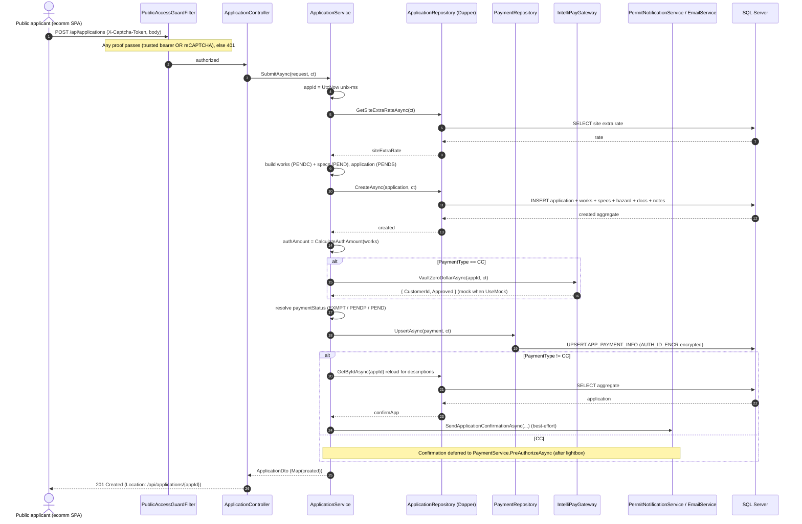
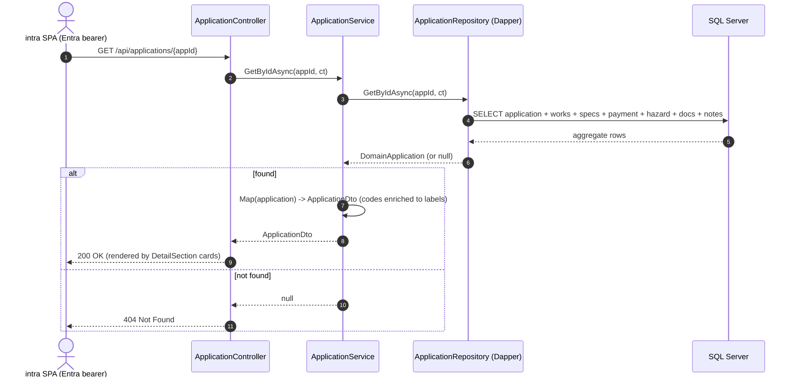

# PWA Wells Permit — Technical Standards & Scaffolding Reference

Extensive technical documentation for the **Alameda County PWA Wells Permit** stack — one **.NET 8
REST API** + two **React 19** SPAs — distilled into reusable standards so you can scaffold **new**
projects that look, feel, and are structured identically.

This document is the **single, self-contained guide**. Each section summarizes a topic and links to a
deep-dive file (with full, copy-paste-ready code) in this same `references/` folder.

> Source of truth: everything here is distilled from the real `pwa-wells-permit-api`,
> `pwa-wells-permit-ecomm-web`, and `pwa-wells-permit-intra-web` code in this monorepo.

---

## Table of contents

1. [Architecture at a glance](#1-architecture-at-a-glance)
2. [.NET REST API — project structure](#2-net-rest-api--project-structure)
3. [.NET REST API — design patterns](#3-net-rest-api--design-patterns)
4. [.NET REST API — conventions & the dual-client security model](#4-net-rest-api--conventions--the-dual-client-security-model)
5. [.NET REST API — backend sequence diagrams](#5-net-rest-api--backend-sequence-diagrams)
6. [.NET REST API — configuration, secrets & testing](#6-net-rest-api--configuration-secrets--testing)
7. [React — project structure](#7-react--project-structure)
8. [React — styling & design tokens](#8-react--styling--design-tokens)
9. [React — layout building blocks (header, footer, side nav)](#9-react--layout-building-blocks-header-footer-side-nav)
10. [React — cards, fields & validation](#10-react--cards-fields--validation)
11. [React — design patterns](#11-react--design-patterns)
12. [Best-practice checklists](#12-best-practice-checklists)
13. [Reference index (deep-dive files)](#13-reference-index-deep-dive-files)
14. [Skills, agents & scaffolding a new project](#14-skills-agents--scaffolding-a-new-project)

---

## 1. Architecture at a glance

The system is a **monorepo** with three deployables that share one design system and one API:

| App | Folder | Audience | Auth | Navigation |
|-----|--------|----------|------|------------|
| **REST API** | `pwa-wells-permit-api` | both SPAs | Entra JWT + DB allowlist (staff), captcha/token (public writes) | — |
| **ecomm (public)** | `pwa-wells-permit-ecomm-web` | anonymous applicants | none + reCAPTCHA | top-nav in header |
| **intra (staff)** | `pwa-wells-permit-intra-web` | county staff | Entra (MSAL) + allowlist | collapsible left sidebar |

**Guiding principles**

- **Clean Architecture** on the backend: dependencies point inward (`WebApi → Application → Domain`);
  `Infrastructure`/`Persistence` implement `Application` interfaces and are wired only in `Program.cs`.
- **Dual-client security**: one API safely serves an anonymous public SPA and an authenticated staff
  SPA; every endpoint picks one of three protections (staff / public-write / open-read).
- **Design tokens over hard-coded styles**: two shared stylesheets (`variables.css` + `global.css`)
  drive the entire look; the brand navy is `#22507a`, the font is **Source Sans Pro**.
- **Folder-per-component** React with co-located CSS; **no** CSS-in-JS, **no** barrel files.
- **Server is the source of truth**: the client validates for UX only; the API re-validates, computes
  fees/status, and reads the acting user from identity — never from the request body.

---

## 2. .NET REST API — project structure

A .NET 8 Web API in **Clean Architecture** layers. Full detail + rules table:
[`dotnet-project-structure.md`](./dotnet-project-structure.md).

```
PWA.PermitsApi.sln
db/                                  # ordered, idempotent SQL migration scripts (001_*.sql, 002_*.sql)
src/
  PWA.PermitsApi.Domain/             # entities/value objects — NO dependencies
  PWA.PermitsApi.Application/        # depends on Domain only
    DTOs/                            #   request/response records
    Interfaces/                      #   IApplicationService, Interfaces/Repositories, Interfaces/Integration
    Services/                        #   business logic (ApplicationService, PaymentService, ...)
    Configuration/                   #   options POCOs (DatabaseOptions, CaptchaOptions, ...)
    Common/  Notifications/  Exceptions/
  PWA.PermitsApi.Infrastructure/     # implements Application integration interfaces (SMTP, FTP, ICAP, IntelliPay, reCAPTCHA)
  PWA.PermitsApi.Persistence/        # implements Application repository interfaces (Dapper)
    DapperContext.cs                 #   IDbConnection factory over the connection string
    Repositories/
  PWA.PermitsApi.WebApi/             # host / composition root
    Program.cs  Controllers/  Authorization/  Middleware/  RateLimiting/  Json/
    appsettings.json + appsettings.{local,Development,TEST,UAT,Production}.json
tests/
  PWA.PermitsApi.Tests/              # xUnit unit tests
  PWA.PermitsApi.E2E/                # live integration suite
```

**Layer rules**

| Layer | May reference | Contains | Never contains |
|-------|---------------|----------|----------------|
| **Domain** | (nothing) | Entities/value objects | EF/Dapper, HTTP, options, `System.Data` |
| **Application** | Domain | Services, DTO **records**, interfaces, options POCOs, helpers | Concrete DB/HTTP/SMTP impls |
| **Infrastructure** | Application, Domain | External integrations behind `Application` interfaces | Controllers |
| **Persistence** | Application, Domain | Dapper repositories + `DapperContext` | Business rules |
| **WebApi** | all | Controllers, DI, filters, middleware, config | Business logic (delegate to services) |

**Composition root (`Program.cs`)** is the single source of truth. Order: bind options → `DapperContext`
(singleton) → repositories (scoped) → services (scoped) → integrations (scoped) → named `HttpClient`s →
controllers (+ global filters, JSON converters) → Swagger/Scalar → ProblemDetails + `GlobalExceptionHandler`
→ Entra JWT auth + default policy → CORS → rate limiter → Serilog.

```csharp
builder.Services.Configure<CaptchaOptions>(builder.Configuration.GetSection("Captcha"));
builder.Services.AddSingleton(new DapperContext(connStr));
builder.Services.AddScoped<IApplicationRepository, ApplicationRepository>();
builder.Services.AddScoped<IApplicationService, ApplicationService>();
builder.Services.AddScoped<IVirusScanner, IcapVirusScanner>();
```

- Add data access → new `IXxxRepository` (Application) + `XxxRepository` (Persistence) + registration.
- Add an integration → new `IXxx` (Application/Interfaces/Integration) + `Xxx` (Infrastructure) with a
  `Xxx.UseMock` option for offline runs.

---

## 3. .NET REST API — design patterns

Full detail: [`dotnet-design-patterns.md`](./dotnet-design-patterns.md).

1. **Repository (Dapper, hand-written SQL)** — interface in Application, impl in Persistence. No ORM.
   `DapperContext` opens an `IDbConnection` per call. **Always parameterize** (`@appId`); dynamic
   sort/paging goes through a whitelist (`SqlOrderBy`) so unknown keys fall back to a safe default.
2. **Service layer** — one `sealed IXxxService` per aggregate; ctor-inject repos + integrations +
   `ILogger<T>`. Owns business rules (fees, status transitions), maps Domain⇄DTO, logs domain events.
   **Mutations re-load and return the refreshed DTO** so the SPA re-renders from server truth.
3. **DTOs are immutable `sealed record`s** with `init` props; normalize functionally with `with`
   (e.g. `request with { OwnerPhone = PhoneNormalizer.DigitsOnly(request.OwnerPhone) }`).
4. **Options pattern** — each config section binds to a POCO via `Configure<T>(section)`, consumed with
   `IOptions<T>`/`IOptionsMonitor<T>`. Integrations carry a `UseMock` flag.
5. **Integration gateways** behind Application interfaces, implemented in Infrastructure, using a
   **named** `HttpClient`; each honors `UseMock` to run offline.
6. **Explicit hand-written mapping** (`Map(domain) => dto`) inside the service — no AutoMapper.
7. **Async + `CancellationToken` everywhere** — threaded controller → service → repo/integration.
8. **Cross-cutting via filters/middleware**, not services (auth, guards, rate limiting, correlation id,
   audit, error handling).

**Naming**

| Thing | Convention |
|-------|------------|
| Interface | `IXxxService`, `IXxxRepository`, `IXxx` (integration) |
| Impl | `sealed class Xxx…`; ctor injection; one class per file |
| DTO | `sealed record`, `init` props; `XxxRequest` / `XxxDto` / `XxxResult` |
| Options | `XxxOptions` POCO bound to config section `Xxx` |
| Async | `…Async` suffix, returns `Task`, takes `CancellationToken` |
| SQL | parameterized (`@name`); dynamic order via whitelist |

---

## 4. .NET REST API — conventions & the dual-client security model

Full detail: [`dotnet-api-conventions.md`](./dotnet-api-conventions.md).

**Controllers are thin**: `[ApiController]`, routed at `api/<resource>`, `sealed`, ctor-inject services,
return `ActionResult<TDto>`, thread the `CancellationToken`, map to `Ok`/`NotFound`/`CreatedAtAction`.
No business logic.

```csharp
[ApiController]
[Route("api/applications")]
public sealed class ApplicationController : ControllerBase
{
    private readonly IApplicationService _applicationService;
    public ApplicationController(IApplicationService applicationService) => _applicationService = applicationService;

    [HttpGet("{appId}")]
    public async Task<ActionResult<ApplicationDto>> GetById(string appId, CancellationToken ct)
        => await _applicationService.GetByIdAsync(appId, ct) is { } app ? Ok(app) : NotFound();

    [HttpPost]
    [ServiceFilter(typeof(PublicAccessGuardFilter))]                 // public write → captcha/token guard
    public async Task<ActionResult<ApplicationDto>> Submit([FromBody] SubmitApplicationRequest req, CancellationToken ct)
    {
        var created = await _applicationService.SubmitAsync(req, ct);
        return CreatedAtAction(nameof(GetById), new { appId = created.AppId }, created);
    }
}
```

**The dual-client security model — the key decision.** For every endpoint pick one of three:

| Kind | Attribute | Enforced by | Failure |
|------|-----------|-------------|---------|
| **Staff** | `[Authorize]` | Entra JWT (`AzureAD`) **+** global `WhitelistAuthorizationFilter` (DB allowlist, cached) | 401 / 403 |
| **Public write** | `[ServiceFilter(typeof(PublicAccessGuardFilter))]` | any `IPublicAccessProof` (trusted bearer **OR** reCAPTCHA `X-Captcha-Token`) | 401 `verification_required` |
| **Open read** | (none) | per-IP sliding-window rate limiter | 429 |

- The acting user for audit columns comes from the **Entra identity** (`ResolveActingUser()`), never
  the request body.
- **Fail-open** in dev: blank `Captcha:SecretKey` disables the captcha guard; blank
  `Auth:TrustedClientIds` treats any validated Entra token as trusted.
- Guarded/authorized routes are **exempt** from the rate limiter (it only throttles open public reads).

**Other cross-cutting conventions**

- **Auth**: `AddJwtBearer("AzureAD", …)` with authority `login.microsoftonline.com/{tenantId}`, audience
  `api://{clientId}`; default policy requires an authenticated user.
- **CORS**: `Cors:EcommOrigin` / `Cors:IntraOrigin` are comma-separated exact origins merged into one
  `PortalClients` policy.
- **Rate limiting**: partitioned sliding window keyed on client IP; rejections are `429`
  `application/problem+json`; config `PermitLimit`/`WindowSeconds`/`SegmentsPerWindow`/`QueueLimit`.
- **Errors**: `AddProblemDetails()` + `AddExceptionHandler<GlobalExceptionHandler>()` → RFC-7807;
  `ErrorStatusAuditMiddleware` audit-emails final `401/403/429`.
- **Logging**: Serilog daily rolling file + `CorrelationIdMiddleware` (`X-Correlation-ID` on every line).
- **JSON leniency**: `LenientStringConverter` + `NumberHandling = AllowReadingFromString`.
- **Docs**: Swagger UI + Scalar (`/scalar`), default on for `local`/`Development` only.

---

## 5. .NET REST API — backend sequence diagrams

The three core flows. Full versions + notes: [`dotnet-sequence-diagrams.md`](./dotnet-sequence-diagrams.md).
Common pipeline (all requests): `ForwardedHeaders → CorrelationId → ErrorStatusAudit → ExceptionHandler
→ Routing → CORS → RateLimiter → Authentication → Authorization → Controller`.

### 5.1 Create Application — `POST /api/applications`



**Payment status rules:** `EXMPT` → `EXMPT`; `CASH`/`CHECK` w/o check number → `PENDP`;
`CC` (and `CHECK` with number) → `PEND`.

### 5.2 Search Applications — `GET /api/applications/search`

```mermaid
sequenceDiagram
    autonumber
    actor Client as ecomm Track / intra staff
    participant Guard as PublicAccessGuardFilter
    participant Ctrl as ApplicationController
    participant Svc as ApplicationService
    participant Repo as ApplicationRepository (Dapper)
    participant DB as SQL Server

    Client->>Guard: GET /api/applications/search?appId=&status=&page=&pageSize=&sortBy=&sortDir=
    Note over Guard: trusted bearer OR X-Captcha-Token, else 401
    Guard->>Ctrl: authorized
    Ctrl->>Svc: SearchAsync(request, ct)
    Svc->>Repo: SearchAsync(request, ct)
    Note over Repo: parameterized WHERE from filters;<br/>SortBy whitelisted (unknown -> newest-first); OFFSET/FETCH paging
    Repo->>DB: SELECT page of matching applications
    DB-->>Repo: rows
    Repo-->>Svc: items
    Svc->>Repo: CountAsync(request, ct)
    Repo->>DB: SELECT COUNT(*) with same filters
    DB-->>Repo: totalCount
    Repo-->>Svc: totalCount
    Svc->>Svc: mapped = items.Select(Map)
    Svc-->>Ctrl: ApplicationSearchResult(mapped, totalCount)
    Ctrl-->>Client: 200 OK { items, totalCount }
```

### 5.3 Application Details — `GET /api/applications/{appId}`



**Staff edits** (`PUT /api/applications/{appId}/project|applicant|hazard|…`) are `[Authorize]`-only; each
normalizes input, calls a repository `Update…Async`, then **re-loads and returns** the refreshed DTO.

---

## 6. .NET REST API — configuration, secrets & testing

- **Per-environment `appsettings.{env}.json`** are committed for **non-secret** keys (CORS origins,
  feature flags, hostnames).
- **Secrets are never committed.** In `appsettings.json` secret values are left **blank** and supplied
  at runtime via environment variables — double-underscore binds to a colon
  (`Captcha__SecretKey` → `Captcha:SecretKey`, `Ftp__Password` → `Ftp:Password`) — or via user-secrets
  in Development. Connection string via `ConnectionStrings:PWAWellPermitsDBConnection`.
- **Integration `UseMock` flags default `false`** (live); set `Xxx__UseMock=true` to run fully offline.

**Testing layout**

- `tests/PWA.PermitsApi.Tests` — fast xUnit unit tests, one file per unit
  (`ApplicationServiceTests.cs`, `FeeCalculatorTests.cs`, `PublicAccessGuardFilterTests.cs`), shared
  `Fakes.cs`. Run `dotnet test tests/PWA.PermitsApi.Tests`; a single class with
  `--filter "FullyQualifiedName~ApplicationServiceTests"`.
- `tests/PWA.PermitsApi.E2E` — live API/UI tests, kept out of the normal loop.

---

## 7. React — project structure

Two flavors share the same structure: **public/ecomm** (anonymous, top-nav, reCAPTCHA) and
**staff/intra** (MSAL auth, left sidebar, user menu, `AuthContext`). Full detail:
[`react-project-structure.md`](./react-project-structure.md).

**Stack**: React 19 + react-scripts (CRA) 5, `react-router-dom` v7, `axios`, `lucide-react`,
optional `@reduxjs/toolkit` + `react-redux`; staff also `@azure/msal-browser` + `@azure/msal-react`;
testing `@testing-library/*`, `jest-axe`, Playwright; env selection via `env-cmd`.

**Folder-per-component, co-located CSS** — every component/page is a folder named after the component
containing its `.js`, a same-named `.css`, and `*.test.js`. No barrel files, no CSS-in-JS.

```
src/
  index.js  index.css  App.js  App.css
  authConfig.js          # staff only: MSAL PublicClientApplication + loginRequest
  styles/
    variables.css        # design tokens (:root custom properties)
    global.css           # reset + shared utilities (.form-*, .btn*, .data-table, .panel, ...)
  config/
    index.js             # selects config.{env} by REACT_APP_ENV, merges window.RUNTIME_CONFIG
    config.{local,dev,test,uat,prod}.js
  api/
    axiosInstance.js     # shared axios; baseURL = config.apiBaseUrl; interceptors
    <domain>Api.js       # endpoint functions per domain area
  components/
    Header/ Footer/ MainContainer/ Loader/ FormSection/
    SideBar/ UserMenu/ DetailSection/    # staff only
    MapPicker/ Modal/
    UI/                  # Button, InputField, SelectField, PhoneField, Pagination, Modal, Toaster/
  constants/  context/  hooks/  utils/
  pages/
    <Feature>/<Feature>.js + .css        # route-level screens; sub-steps in steps/ subfolders
```

**Config layering (never read `process.env` in components).** `src/config/index.js` resolves one
object; build-time `REACT_APP_ENV` picks the file, and `window.RUNTIME_CONFIG` (served from
`public/configs/config.js`) overrides **without a rebuild**:

```js
const env = process.env.REACT_APP_ENV || 'local';
const runtime = window.RUNTIME_CONFIG || {};
const selected = configs[env] || localConfig;
const config = { ...selected, ...runtime, environment: env };
export default config;
```

**App shell (staff)** — fixed-viewport; header/sidebar/footer stay put, only content scrolls. Route
changes close the mobile drawer; standalone print routes render without chrome; the whole app is gated
by the allowlist (`accessDenied` → `<NotAuthorized/>`).

```jsx
<div className="app-shell">
  <MainContainer>
    <Header onMenuToggle={() => setMobileNavOpen(o => !o)} />
    <div className="staff-layout">
      <SideBar mobileOpen={mobileNavOpen} onClose={() => setMobileNavOpen(false)} />
      <main id="main-content" className="staff-content" tabIndex={-1}>
        <div className="staff-content__inner"><Routes>{/* ... */}</Routes></div>
      </main>
    </div>
  </MainContainer>
  <Footer />
</div>
```

---

## 8. React — styling & design tokens

The look comes from two shared stylesheets imported verbatim by both SPAs: `src/styles/variables.css`
(tokens) and `src/styles/global.css` (reset + utilities). **Never hard-code colors/spacing/fonts —
use the tokens.** Full detail: [`react-styling.md`](./react-styling.md).

Font: **Source Sans Pro** (400/600/700) via a `<link>` in `public/index.html` (`theme-color` `#22507a`).

**Brand palette**

| Role | Token | Value |
|------|-------|-------|
| Primary navy (header, table head, active nav, buttons) | `--color-primary` / `--btn-primary-bg` | `#22507a` |
| Primary hover / dark | `--color-primary-dark` | `#1b3f61` |
| Danger / mandatory | `--btn-danger-bg` / `--mandatory-red` | `#a11f1c` |
| App background | `--color-background` | `#f4f4f4` |
| Body text | `--text-primary` | `#333333` |
| Link | `--link-color` | `#1f4e79` |
| Card shadow | `--shadow-card` | `3px 3px 3px rgba(0,0,0,.05)` |

**Reusable `global.css` utilities** (prefer these over new CSS):

- **Forms**: `.form-row` (label ≥160px + `.form-col`), `.form-control` (focus glow, `.is-invalid`
  red), `.mandatory`, `.field-error`, `.text-muted`, `.form-col-fixed-sm/md`.
- **Buttons**: `.btn` + `.btn-primary` (navy) / `.btn-danger` (red) / `.btn-default` (grey) / `.btn-link`.
- **Tables**: `.data-table` (navy sticky header, zebra rows, hover), `.table-scroll` (bounded scroll
  under 900px), `table.simple-table`.
- **Layout/surfaces**: `.app-shell` (100dvh, `overflow:hidden`), `.page-shell`, `.panel`, `.page-title`,
  `.grid-two`/`.grid-three` (collapse to 1 col ≤900px), `.status-pill`, `.alert`/`.alert-error`/`.alert-success`.

**Responsive breakpoints**

| Width | Effect |
|-------|--------|
| ≤ 900px | grids → 1 col; sidebar → full-viewport drawer; header hamburger shows; `.table-scroll` → 70dvh box |
| ≤ 760px | `DetailSection` two-column body → single column |
| ≤ 560px | header title hidden |

**Rules**: consume tokens (don't invent hex); one co-located `.css` per component; BEM-ish class names
(`.block__element--modifier`); visible focus rings; underline body-text links.

---

## 9. React — layout building blocks (header, footer, side nav)

**Header** ([`react-header.md`](./react-header.md)) — navy full-width strip: left brand block (mobile
hamburger + two agency logos on white chips + app title), right app-specific slot (`<UserMenu/>` for
staff, top-nav `<NavLink>`s for public). Brand block is a keyboard-operable `role="button"` that
navigates home. Adapt only the logo files, title text, and right-slot control.

**Footer** ([`react-footer.md`](./react-footer.md)) — slim navy bar, `flex-shrink:0` so it never
collapses in the shell; left support/help-desk line, right dynamic copyright
(`{new Date().getFullYear()}` — never hard-code the year); stacks centered ≤560px. Adapt only the two
strings.

**Left / side navigation (staff only)** ([`react-side-nav.md`](./react-side-nav.md)) — collapsible,
multi-level sidebar with inline-SVG icons, a desktop icon-only rail (52px), and a full-viewport mobile
drawer. Nav is **declarative** in a `NAV_ITEMS` array (leaf has `link`; group has `children` and is
non-navigable):

```js
const NAV_ITEMS = [
  { key: 'home', label: 'Home', link: '/', end: true, icon: ICONS.home },
  { key: 'processing', label: 'Processing', icon: ICONS.processing, children: [
      { key: 'q-pend', label: 'Pending Applications', link: '/queue/PEND' },
      { key: 'q-apprv', label: 'Approved Permits', link: '/queue/APPRV' },
  ]},
  { key: 'reports', label: 'Reports', link: '/reports', icon: ICONS.reports },
];
```

Behavior: **auto-expand** the group containing the active route (without collapsing groups the user
opened); desktop collapse toggle shrinks to a 52px icon rail; mobile drawer slides in with a dimmed
overlay and always shows full labels. Full a11y (`aria-expanded` on groups, `aria-label` on toggles).
Sidebar palette is its own dark set (rail `#2c3e50`, header `#243342`, active `#22507a`). Adapt only
`NAV_ITEMS`, the `ICONS` you need, and the title.

---

## 10. React — cards, fields & validation

**Cards** ([`react-cards.md`](./react-cards.md)) — two primitives structure every screen:

| Use | When |
|-----|------|
| `FormSection` | User is **entering/editing** data (titled white panel, colored top accent, optional `headerRight`). |
| `DetailSection` + `DetailField` | Displaying **read-only** record details (navy header bar, two-column label:value body, optional Edit action). |
| `.panel` (global) | Generic white card that isn't a form or detail record. |

**Fields & buttons** ([`react-fields.md`](./react-fields.md)) — primitives in `components/UI/` that all
render the same `.form-row`/`.form-control` markup, so every form looks identical. Compose forms from
these; don't write raw `<input>`s.

- `InputField` / `SelectField` / `PhoneField` take `label`, `id`, `error`, `required` and spread
  `...props` onto the native control. `SelectField` options are `{ code, label }`. `PhoneField` is
  three segments (3/3/4) normalized to digits-only.
- `Button` maps `variant` → class: `primary`→navy, `secondary`/`default`→grey, `danger`→red,
  `ghost`/`link`→text. Defaults to `type="button"`.
- Error state: pass `error` (a string) → adds `.is-invalid` + renders `.field-error`; `hint` shows
  muted helper text only when there's no error. Multi-column forms wrap rows in `.grid-two`/`.grid-three`.

```jsx
<FormSection title="Contact">
  <div className="grid-two">
    <InputField id="firstName" label="First Name" required
                value={fd.firstName} onChange={onChange('firstName')} error={errors.firstName} />
    <SelectField id="state" label="State" required placeholder="Select…"
                 options={states} value={fd.state} onChange={onChange('state')} error={errors.state} />
  </div>
  <div className="form-actions">
    <Button variant="secondary" onClick={onBack}>Back</Button>
    <Button type="submit">Continue</Button>
  </div>
</FormSection>
```

**Validation** ([`react-validation.md`](./react-validation.md)) — plain functions, not a form library,
in two layers:

1. `validation.js` — small, pure validators returning **a message string or `null`**:
   `validateX(value, { label, required, maxLen }) => string | null`.
2. `stepValidators.js` — composes them into an `errors` object keyed by field name.

```js
function handleNext() {
  const e = applicantErrors(formData);
  const hasErrors = Object.values(e).some(Boolean);   // any non-null message
  setErrors(e);
  if (hasErrors) return;                               // block until clean
  goToNextStep();
}
```

Conventions: validators return **messages** (unit-testable next to a `*.test.js`); reject quotes in
free-text (legacy anti-injection); enforce `maxLen` to DB column widths; normalize before sending;
**client validation is a UX layer only** — the API re-validates independently.

---

## 11. React — design patterns

Full detail: [`react-design-patterns.md`](./react-design-patterns.md).

1. **Single axios instance + interceptors.** All HTTP goes through one `axiosInstance`; domain modules
   (`api/<domain>Api.js`) export `verbNoun` functions. **ecomm** attaches the reCAPTCHA token as
   `X-Captcha-Token` per guarded call; **intra** acquires the MSAL bearer silently in a request
   interceptor and turns any `403` into a global `pwa:not-authorized` event.
2. **Auth (staff): MSAL + allowlist gate.** `authConfig.js` builds the `PublicClientApplication`;
   `AuthContext` tracks the user + `accessDenied`; the dev port is fixed (3003) to match registered
   redirect URIs.
3. **Data fetching**: page-level `useEffect` + local `data`/`loading`/`error`; `<Loader/>` while
   loading, `.alert-error` on failure; guard against unmounted updates (`let alive = true`). Redux
   Toolkit only for cross-route state (e.g. an in-progress wizard).
4. **Toasts & modals**: a `ToastProvider` for post-mutation notices (not `alert()`); an accessible
   `Modal` primitive (`role="dialog"`, `aria-modal`, Escape/backdrop close, scroll-lock).
5. **Routing**: routes centralized in `App.js`; `NavLink` drives active styling; print routes render
   without chrome; child routes use path prefixes so the sidebar auto-expands.
6. **Reference/code data**: status/payment codes in `constants/` as `{ code, label }`, kept in sync
   with the DB code tables.
7. **Accessibility (WCAG 2.1 AA)**: visible focus rings; `aria-label` on icon-only controls;
   `aria-hidden` on decorative SVGs; `main#main-content` focus target; `jest-axe` assertions.
8. **Testing**: Jest + RTL co-located `*.test.js` (`npm test -- --watchAll=false`); Playwright e2e in
   `e2e/` mocking the API with `page.route` (`npm run test:e2e`).

**Naming**

| Thing | Convention |
|-------|------------|
| Component / folder | `PascalCase` (folder + `.js` + `.css` same name) |
| Hooks | `useCamelCase` in `hooks/` |
| API modules | `<domain>Api.js`, exported `verbNoun` functions |
| CSS classes | BEM-ish `.block__element--modifier`; consume tokens |
| Config access | import from `src/config`; never `process.env` in components |
| Icons | `lucide-react`, or inline SVG for nav (inherits `currentColor`) |

---

## 12. Best-practice checklists

**New .NET endpoint**

1. Pick protection: `[Authorize]` (staff) / `PublicAccessGuardFilter` (public write) / none + rate-limit
   (open read).
2. Route `api/<resource>`; return `ActionResult<TDto>`; thread `CancellationToken`.
3. Delegate to a service; read the acting user from the identity for audit, not the body.
4. Parameterize all SQL; whitelist any dynamic sort/paging.
5. Return `Ok`/`NotFound`/`CreatedAtAction`; let the global handler shape errors.
6. Add a unit test (service + filter behavior).

**New React screen**

1. Folder-per-component with co-located `.css` + `*.test.js`.
2. Import `config` from `src/config`; call the API only through `api/<domain>Api.js`.
3. Build the UI from `FormSection`/`DetailSection` + `UI/` fields; use `.grid-two`/`.grid-three`.
4. Consume design tokens; add a token instead of a new hex.
5. Validate with pure validators returning messages; block submit while any error exists.
6. A11y pass (labels, focus, `aria-*`); add a `jest-axe` test.

**Secrets (both stacks)**

- `.NET`: blank secret values in `appsettings.json`; supply via env vars (`Section__Key`) / user-secrets.
- `React`: keep public keys (reCAPTCHA **site** key, Maps key, Azure client/tenant IDs) out of source
  where possible; inject real values at build/deploy via `REACT_APP_*`; blank the committed fallbacks.

---

## 13. Reference index (deep-dive files)

Every topic above has a full, copy-paste-ready deep-dive in this folder.

### React frontend standards
| File | Covers |
|------|--------|
| [`react-project-structure.md`](./react-project-structure.md) | Folder-per-component layout, config layering, API layer, routing, app shell |
| [`react-styling.md`](./react-styling.md) | CSS design tokens, `global.css` utilities, buttons, tables, responsive rules |
| [`react-header.md`](./react-header.md) | Top header bar (brand, logos, hamburger, user menu) |
| [`react-footer.md`](./react-footer.md) | Footer bar |
| [`react-side-nav.md`](./react-side-nav.md) | Collapsible multi-level left sidebar + mobile drawer |
| [`react-cards.md`](./react-cards.md) | `FormSection` panels and `DetailSection` label:value cards |
| [`react-fields.md`](./react-fields.md) | `InputField`, `SelectField`, `PhoneField`, `Button`, form-row grid |
| [`react-validation.md`](./react-validation.md) | Reusable validators + per-step validation pattern |
| [`react-design-patterns.md`](./react-design-patterns.md) | Component/state/data-fetch patterns, accessibility, toasts, modals |

### .NET backend standards
| File | Covers |
|------|--------|
| [`dotnet-project-structure.md`](./dotnet-project-structure.md) | Clean Architecture layers, projects, DI wiring |
| [`dotnet-design-patterns.md`](./dotnet-design-patterns.md) | Repository, service, options, mapping, DTO record patterns |
| [`dotnet-api-conventions.md`](./dotnet-api-conventions.md) | Controllers, auth model, guards, rate limiting, logging, error handling |
| [`dotnet-sequence-diagrams.md`](./dotnet-sequence-diagrams.md) | Mermaid sequence diagrams: Create Application, Search, Application Details |

### Skills & agents (drop-in Copilot config)
| File | Purpose |
|------|---------|
| [`react-standards.SKILL.md`](./react-standards.SKILL.md) | Skill that indexes the React references |
| [`dotnet-standards.SKILL.md`](./dotnet-standards.SKILL.md) | Skill that indexes the .NET references |
| [`react-frontend.agent.md`](./react-frontend.agent.md) | Builds React UI in this house style |
| [`dotnet-backend.agent.md`](./dotnet-backend.agent.md) | Builds .NET API layers to these conventions |
| [`pwa-scaffolder.agent.md`](./pwa-scaffolder.agent.md) | Orchestrates a full new-project scaffold, with options |

---

## 14. Skills, agents & scaffolding a new project

**Using these when scaffolding a new project**

1. **Read the relevant reference** for the piece you're building (e.g. `react-side-nav.md`).
2. **Copy the code blocks verbatim** — the CSS files and component shells are domain-agnostic; only the
   *content* (nav items, titles, routes, logos, config URLs) changes per project.
3. **Adapt names** to the new domain.

**Turning the skills/agents into auto-loaded Copilot config (optional)**

These files are references. To make Copilot load them automatically in **every** session, copy them
into your user config using the required folder shape:

```powershell
# Skills  ->  ~/.copilot/skills/<name>/SKILL.md
New-Item -ItemType Directory -Force "$env:USERPROFILE\.copilot\skills\react-standards"
Copy-Item .\react-standards.SKILL.md  "$env:USERPROFILE\.copilot\skills\react-standards\SKILL.md"
New-Item -ItemType Directory -Force "$env:USERPROFILE\.copilot\skills\dotnet-standards"
Copy-Item .\dotnet-standards.SKILL.md "$env:USERPROFILE\.copilot\skills\dotnet-standards\SKILL.md"

# Agents  ->  ~/.copilot/agents/<name>.md   (or a repo's .github/agents/)
New-Item -ItemType Directory -Force "$env:USERPROFILE\.copilot\agents"
Copy-Item .\*.agent.md "$env:USERPROFILE\.copilot\agents\"
```

This machine also has a `pwa-scaffold` skill (with verbatim component templates) at
`~/.copilot/skills/pwa-scaffold/`. These references are the **standards/documentation** companion to
that template pack.
