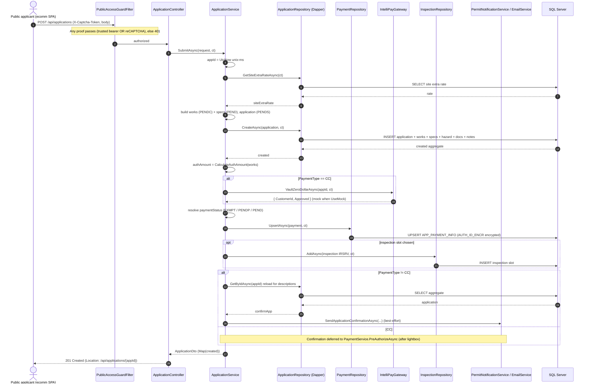
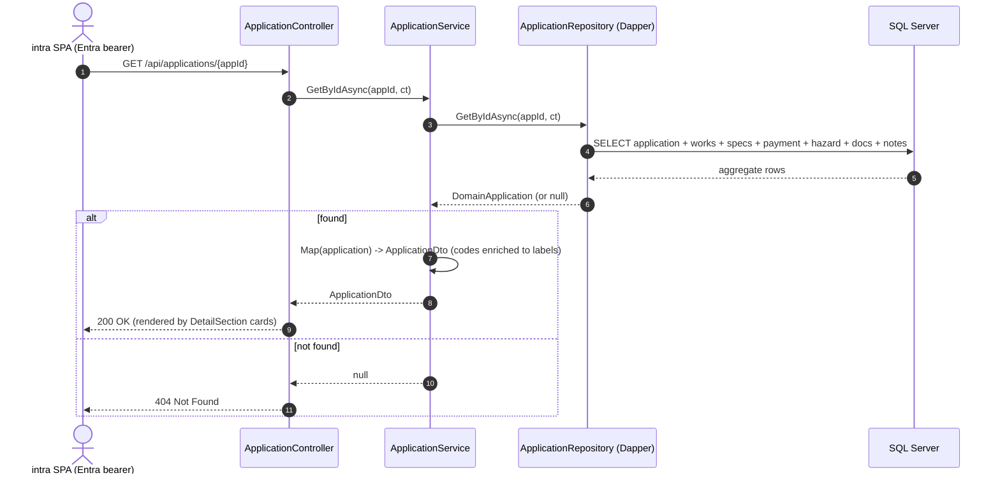

# .NET — Backend Sequence Diagrams

Mermaid sequence diagrams for the three core flows. Rendered by GitHub, VS Code (Mermaid preview),
and most Markdown viewers. Grounded in `ApplicationController` + `ApplicationService` +
`ApplicationRepository`.

Common request pipeline (applies to all): `ForwardedHeaders → CorrelationIdMiddleware →
ErrorStatusAuditMiddleware → ExceptionHandler → Routing → CORS → RateLimiter → Authentication →
Authorization → Controller`.

---

## 1. Create Application — `POST /api/applications`

Anonymous public write, guarded by captcha/token. Status codes mirror the legacy `ProcessAppServlet`:
application → `PENDS`, works → `PENDC`, specs → `PEND`. The CC card is **vaulted for $0** at submit;
the real fee is charged later by staff.



**Payment status rules:** `EXMPT` → `EXMPT` (paid 0); `CASH` and `CHECK` without a check number →
`PENDP` (Pending Payment); `CC` (and `CHECK` with a number) → `PEND` (Pending Approval).

---

## 2. Search Applications — `GET /api/applications/search`

Anonymous public read (ecomm Track) also called by the staff SPA. Guarded, paged, whitelisted sort.
Returns items + total count for server-side pagination.

```mermaid
sequenceDiagram
    autonumber
    actor Client as ecomm Track / intra staff
    participant Guard as PublicAccessGuardFilter
    participant Ctrl as ApplicationController
    participant Svc as ApplicationService
    participant Repo as ApplicationRepository (Dapper)
    participant DB as SQL Server

    Client->>Guard: GET /api/applications/search?appId=&status=&page=&pageSize=&sortBy=&sortDir=
    Note over Guard: trusted bearer OR X-Captcha-Token, else 401
    Guard->>Ctrl: authorized
    Ctrl->>Svc: SearchAsync(request, ct)

    Svc->>Repo: SearchAsync(request, ct)
    Note over Repo: parameterized WHERE from supplied filters;<br/>SortBy whitelisted (unknown -> newest-first); OFFSET/FETCH paging
    Repo->>DB: SELECT page of matching applications
    DB-->>Repo: rows
    Repo-->>Svc: items

    Svc->>Repo: CountAsync(request, ct)
    Repo->>DB: SELECT COUNT(*) with same filters
    DB-->>Repo: totalCount
    Repo-->>Svc: totalCount

    Svc->>Svc: mapped = items.Select(Map)
    Svc-->>Ctrl: ApplicationSearchResult(mapped, totalCount)
    Ctrl-->>Client: 200 OK { items, totalCount }
```

---

## 3. Application Details — `GET /api/applications/{appId}`

Loads the full aggregate for the intra Application Detail screen (the staff SPA also sends the Entra
bearer via its axios interceptor). Returns `404` when not found.



**Staff edits** from the detail screen (`PUT /api/applications/{appId}/project|applicant|hazard|…`) are
`[Authorize]`-only; each normalizes input (`with { Phone = PhoneNormalizer.DigitsOnly(...) }`), calls a
repository `Update…Async`, then **re-loads and returns** the refreshed `ApplicationDto` so the SPA
re-renders from server truth. The acting user comes from `ResolveActingUser()` (Entra identity), not
the body.
